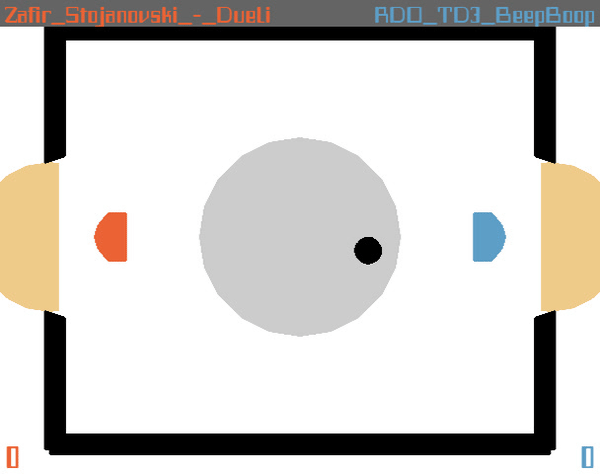

# Laser Hockey Reinforcement Learning Challenge

This repository contains our team's winning entry for the Laser Hockey challenge as part of the Reinforcement
Learning course offered at Eberhard Karls University of Tuebingen (Germany). The agents are trained on the modified Laser 
Hockey environment, which can be found [here](https://github.com/antic11d/laser-hockey-env.git) and installed as a 
pip package with: `pip install git+https://github.com/antic11d/laser-hockey-env.git`

Laser Hockey is a custom environment built using the [Open AI gym](https://gym.openai.com). The environment is 
essentially a two player hockey game, in which the agents compete to score a goal against each other. 
Although seemingly simple, the environment encapsulates a lot of complexities and hardships under the hood.

Is reinforcement learning truly needed to find an optimal policy for playing the game? In short, yes. We demonstrated 
that our trained reinforcement learning agents easily manage to defeat the algorithmic basic opponent provided by the 
environment. 

Moreover, **our solution was the winning entry in the tournament** between all trained agents from the participants. 
This tournament consisted of two phases:
1. A regular phase that included 70+ entries from all course participants
2. A play-off phase that included only the top 10 teams from the regular session

The leaderboard with the final results from the play-off phase 
can be found [here](http://al-hockey.is.tuebingen.mpg.de/). Furthermore, the certificate for winning the competition 
can be found [here](assets/Certificate_1st-Place.pdf)

We presented both discrete and continuous action-space solutions for this problem. In particular, these are the 
algorithms that each of the authors have implemented:
1. **Dueling DQN with Prioritized Experience Replay** ([Zafir Stojanovski](https://github.com/zafir-stojanovski))
2. **Soft Actor-Critic** ([Dimitrije Antic](https://github.com/antic11d))
3. **Deep Deterministic Policy Gradient** ([Jovan Cicvaric](https://github.com/cile98))

**An extensive report** containing detailed algorithm descriptions, ablation/sensitivity studies on the model's 
hyperparameters, and tricks that played an important role in helping us win the challenge could be found 
[here](assets/RL_project_report.pdf).